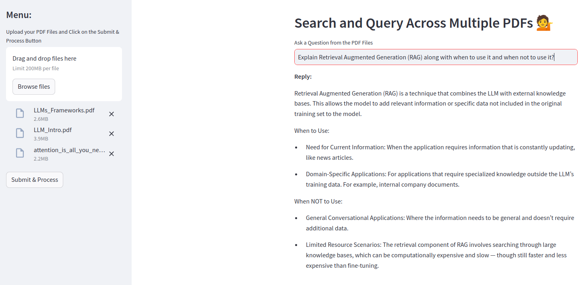

# Search and Query Across Multiple PDFs  

This project empowers users to interact with multiple PDF documents through conversational AI. By uploading PDFs, you can ask questions and receive precise answers extracted directly from the content of your documents. This solution is built using Natural Language Processing (NLP) techniques and leverages Google's **Gemini model**, along with advanced vector embedding and conversational AI technologies, to streamline document interaction and analysis.  

## Features  

- Upload and process multiple PDF documents.  
- Use natural language queries to extract relevant information from the uploaded PDFs.  
- AI-powered responses for precise and accurate answers.  
- Supports complex multi-page documents and retrieves insights efficiently.  
- Reduces manual review time, improving productivity and accuracy.  

## How It Works  

1. **Document Upload**: Upload one or more PDF documents.  
2. **Text Extraction**: The application processes and extracts text from the PDFs.  
3. **Vector Embeddings**: Using embeddings, the content is indexed for efficient querying.  
4. **Conversational Querying**: Ask questions in natural language, and the chatbot will respond with answers based on the uploaded documents.  

## Technologies Used  

- **Streamlit**: For building an intuitive user interface.  
- **Google Generative AI (Gemini)**: For conversational AI and precise answers.  
- **LangChain**: For creating a conversational AI chain.  
- **PyPDF2**: For PDF text extraction.  
- **FAISS**: For fast vector similarity search.  

## Requirements  

Install the dependencies using the `requirements.txt` file:  

```bash  
streamlit  
google-generativeai  
python-dotenv  
langchain  
PyPDF2  
faiss-cpu  
langchain_google_genai  
```  

Install these dependencies by running:  

```bash  
pip install -r requirements.txt  
```  

## Getting Started  

1. Clone this repository:  

   ```bash  
   git clone https://github.com/your-username/search-query-pdfs.git  
   cd search-query-pdfs  
   ```  

2. Install the required dependencies as mentioned above.  

3. Create a `.env` file to store your **Google Generative AI API key**:  
   ```  
   GOOGLE_API_KEY=your_api_key  
   ```  

4. Run the application:  
   ```bash  
   streamlit run app.py  
   ```  

5. Open the URL displayed in your terminal to interact with the application.  

## Usage  

1. Upload one or more PDFs using the interface.  
2. Enter your query in the text box.  
3. Receive an AI-generated response with precise answers based on the uploaded documents.  

## Demo  
 
Provide screenshots or a link to a demo if available.  

## Contributions  

Contributions are welcome! Feel free to open issues or submit pull requests to improve the project.  

## License  

This project is licensed under the MIT License. See the [LICENSE](LICENSE) file for details.  

---  

Feel free to adapt the content or structure as needed!
